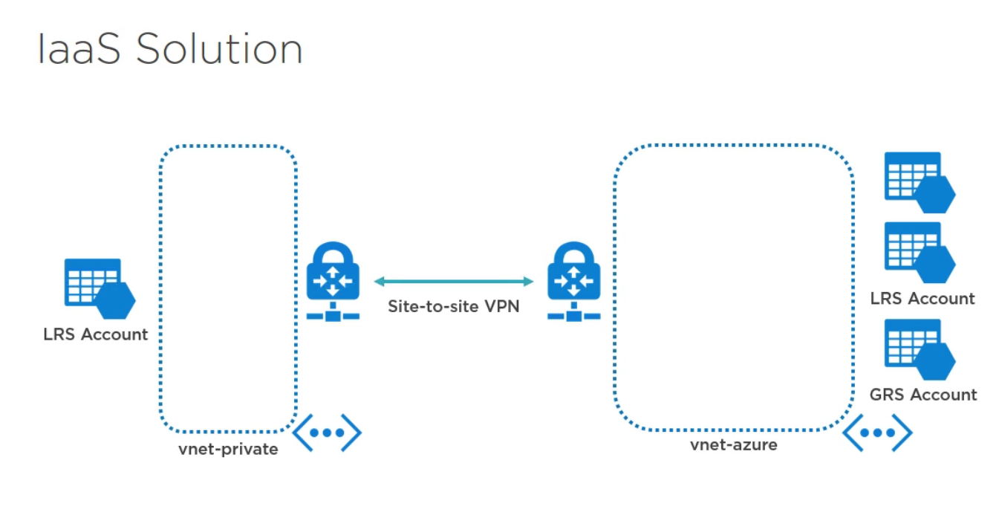

# Building ARM Infrastructure

_**Creating an IaaS solution**_

## Overview
This lab will guide the user through creating an IaaS solution using ARM templates.

### Lab Goals
- Review ARM template
- Deploy storage resources
- Deploy networking resources
- Deploy vNet peering
- Validate deployment of the above resources

#### Product overview

**Capabilities or components used in this scenario:** 
The following resource types will be created as part of the lab:
 
•	Storage accounts
•	Virtual networks
•	Public IP addresses
•	Virtual network peering
•	Connections