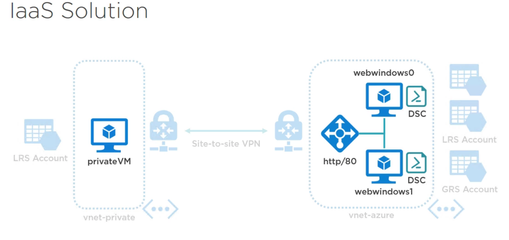

# Deploying Virtual Machines

## Overview
In this lab you will extend an ARM template to deploy virtual machines and a load balancer into the infrastructure.

### Lab Goals
- Deploy "private" virtual machine
- Deploy remote virtual machines
- Configure remote virtual machines with DSC
- Deploy load balancer
- Validate the deployment and configuration of all of these resources

#### Product overview

**Capabilities or components used in this scenario:** 
•	Network Interfaces
•	Virtual Machines
•	Virtual Machine Extensions
•	Availability Sets
•	Load Balancers
