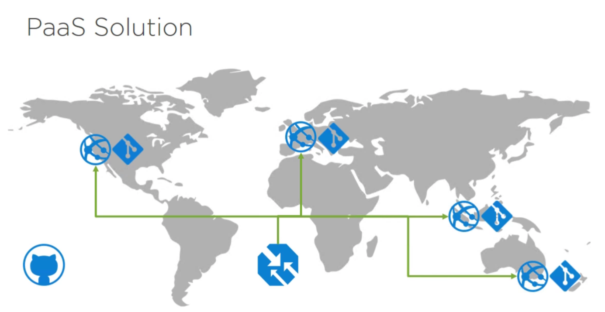

# Building ARM Services
_**Creating PaaS services in Azure with ARM Templates**_

## Overview
This lab will guide the user through creating PaaS services in Azure with ARM templates. You will deploy web server farms in different geographical locations, deploy websites to these server farms, configure and deploy a Traffic Manager, and configured web applications from code stored on GitHub.

### Lab Goals
- Create new ARM template
- Deploy full PaaS solution
- Populate web site from Github source control

#### Product overview

**Capabilities or components used in this scenario:** 
•	Web Farms
•	Virtual Machines
•	Traffic Manager
•	GitHub Web Application code