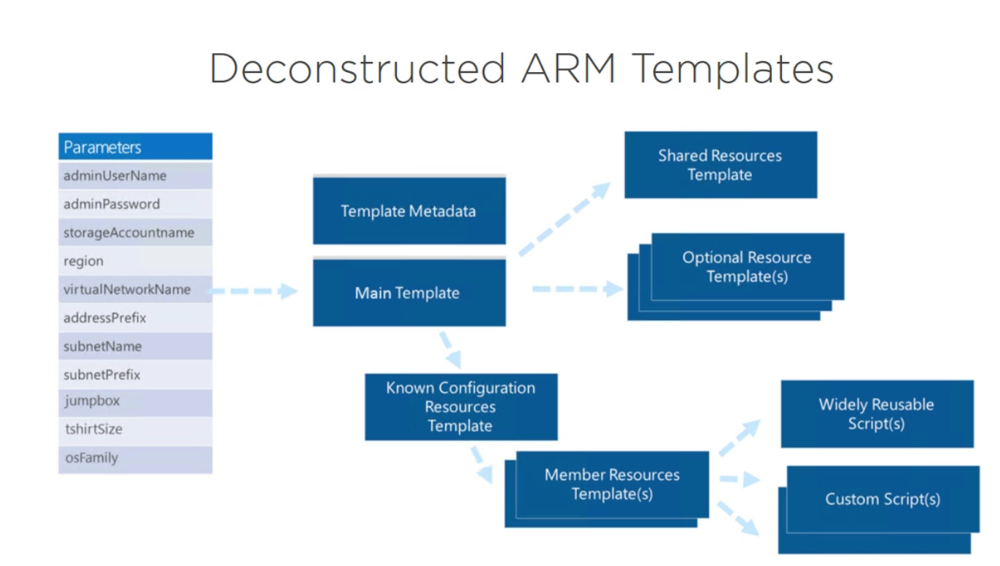

# Authoring Deconstructed Templates

## Overview
Deconstructed templates break down an ARM template into reusable templates that can be shared among several different solutions. This is accomplished by creating a master template, which is then used to orchestrate several different resource templates to create the resources required by the solution.
 
### Lab Goals
- Understand deconstructed template structure
- Share outputs between templates
- Explore nested deployments
- Store deployment secrets in a Key Vault
- Link to shared templates
- Deploy a nested template solution

#### Product overview

**Capabilities or components used in this scenario:** 
- ARM template file
- ARM parameters file
- Individual resource template files
- Key Vault
