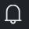

## **Scenario 1 - Navigation**

Perform the following steps to get familiar with navigating the Azure portal.

**Sign in to the Azure portal**

1. [Click here to open the Azure portal](https://portal.azure.com) and maximize the browser window

1. In the **Email or phone** field, enter **<inject key="AzureAdUserEmail" />** and click **Next**

1. In the **Password** field, enter **<inject key="AzureAdUserPassword" />**

1. Click **Sign in**

1. You _may_ encounter a popup entitled **Stay signed in?** with buttons for **No** and **Yes** - Choose **No**

1. You _may_ encounter a popup entitled **Welcome to Microsoft Azure** with buttons for **Start Tour** and **Maybe Later** - Choose **Maybe Later**

## **Home page and tiles**
#### Part A - Settings and notifications

1. At the top of the **Dashboard** page, click on the **Fullscreen** button to change the page to the fullscreen mode. Press the **Esc** key on your keyboard to exit fullscreen mode
1. In the top right-hand corner, click on **Settings** 
1. Choose a different theme color, and click **Apply**
1. In the top right-hand corner, click on Notifications 
1. Close the Notifications blade

    >**Note:** You can review the status of any activity performed within the Azure portal.
	
#### Part B - Tiles

You will notice several tiles on the **Dashboard** page such as All resources, Get started, Marketplace, and Service health. Just like your desktop icons, these tiles provide quick access to Azure resources and different parts of the portal. Perform the following steps to observe the tile functions:

1. In the menu on the left side (referred to as the **Favorites** menu), click the **Show menu** button  and then click on **Azure Active Directory**
1. Click on the pin  at the top of the **Azure Active Directory** blade which will create a tile on the Dashboard 
1. Close the **Azure Active Directory** blade and note the new **Azure Active Directory** tile that now appears on the Dashboard
1. On the **Dashboard** page, click the **Show menu** button  to expand the **Favorites** menu, if it is collapsed
1. Click on **All resources** to review the list of resources used for this lab
1. Close the **All resources** blade
1. Click **Service Health** tile on the **Dashboard**
1.	Click on **Health history**, select an option in the **Time range** dropdown menu to view all past issues for that time period
1. Close the **Service Health** blade
1. Click on **Monitor** in the **Favorites** menu 
1. Click on **Activity log** 
1. Select an option in the **Timespan** dropdown menu and select **All categories** in the **Event category** dropdown menu then click **Apply** to view a log of activities for that time period
1. Close the **Activity log** blade
1. Click the **Marketplace** tile and note the different offerings and categories that appear on the **Everything** blade
1. Close the **Everything** blade
1. Close the **Marketplace** blade
1. On the **My Dashboard** page, click the **Show menu** button  to expand the **Favorites** menu, if it is collapsed
1. Click **Help + support** at the bottom of the **Favorites** menu and note the links to different support resources
1. On the **Help + support** blade, click  **New support request** to open the **New support request** blade which you can use to create a support ticket
1. Close the **New support request** blade

    >This completes this scenario. Click on **Next** to go to the next scenario.